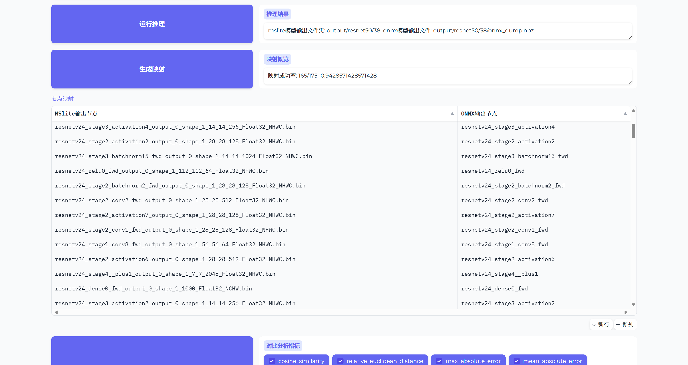
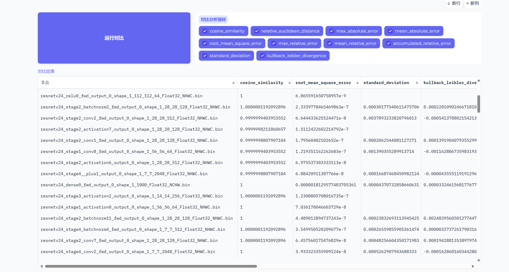
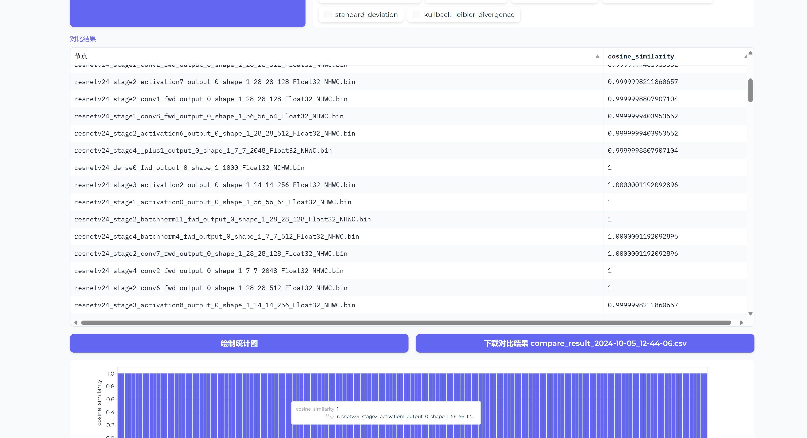

# MindAcc

MindAcc 是一个用于对比 MindSpore Lite 与 ONNX 模型推理结果的工具，支持模型转换、随机输入生成、推理运行、对比分析等功能。

## 安装

1. 克隆仓库：
    ```sh
    git clone https://gitee.com/noiatrio/mindacc
    cd mindacc
    ```

2. 安装 python 依赖：

    使用 `python venv`：
    ```sh
    python -m venv mindacc
    source mindacc/bin/activate
    pip install -r requirements.txt
    ```

    使用 `conda`：
    ```sh
    conda env create -f environment.yml
    conda activate mindacc
    ```

3. 获取 `mslite` 运行环境：

    - 下载 [MindSpore Lite 端侧运行环境](https://www.mindspore.cn/lite/docs/zh-CN/master/use/downloads.html)（包含convert与带导出功能的benchmark工具），将 `mindspore-lite-2.3.1-linux-x64` 置于当前目录下即可。
    - 相关环境变量将只在 `main.ipynb` 中自动设置，并在 `mindacc` 运行的python环境中生效，无需手动设置。
    - 环境变量设置详细信息请参考 [convert](https://www.mindspore.cn/lite/docs/zh-CN/master/train/converter_train.html)， [benchmark](https://www.mindspore.cn/lite/docs/zh-CN/master/tools/benchmark_tool.html#dump功能)。

## 使用方法
运行 `main.ipynb`：
    - 使用 Jupyter Notebook 或 Jupyter Lab 打开 `main.ipynb` 文件。
    - 点击“运行所有”按钮运行所有代码单元格。
    - 在浏览器中打开 Gradio 界面，即可使用 MindAcc 工具。

## 主要功能

- **模型转换**：支持将 ONNX 模型转换为 MindSpore Lite 模型。
- **随机输入生成**：自动生成随机输入数据。
- **推理运行**：运行 MindSpore Lite 和 ONNX 模型推理。
- **对比分析**：对比推理结果，支持多种分析指标，支持可视化对比结果。
- **自定义映射**：支持自定义算子映射。

## 示例





## 许可证

本项目基于 MIT 许可证，详情请参阅 [LICENSE](LICENSE) 文件。

## 贡献

欢迎贡献代码！请提交 Pull Request 或报告 Issue。
